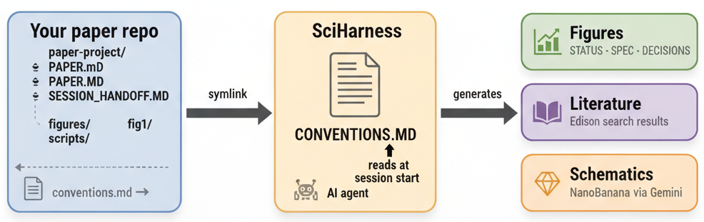

# SciHarness

SciHarness is a project scaffold + conventions layer + tool integrations for AI-assisted academic research.

SciHarness aims to catalyze day-to-day scientific progress by: 
(1) Providing a single entrypoint for coding, writing, literature search, and figure generation.
(2) Maintaining persistent goals across projects, figures, and panels for easy resumption of work.
(3) Reducing time spent preparing for presentations by continuously generating `.html` representations of progress.
(4) Accelerating feedback integration through checkpointing, which can integrate meeting notes, allowing users to prepare update HTMLs for future meetings.

In short, SciHarness is an LLM-agnostic approach for streamlining iteration across scales, whether it be panel tweaks, high-level strategic planning, or communicating results to collaborators and mentors.

SciHarness achieves these goals through a consistent directory structure, workflow conventions, and two integrated tools — **NanoBanana** (schematic generation via Gemini) and **Edison** (literature search) — so that any AI agent can pick up a project mid-session with shared project state. SciHarness has been primarily prototyped in Cursor, allowing for easy switching between LLMs, but aims to be compatible with other agentic coding solutions.

 

---

## Philosophy

Scientific workflow is often spread across too many tools: the browser for literature search, LLM chats for ideation, a code interpreter for analysis, Illustrator or PowerPoint for figures, and scattered notes for meeting prep. As a result, figure work gets fragmented across scripts, notebooks, chats, and slide decks, while lab meeting preparation often requires stepping away from the actual work to manually sculpt progress into presentations.

SciHarness is built to reduce this fragmentation for individual researchers. It treats the research project itself as the central workspace, so that writing, coding, figure iteration, literature search, meeting preparation, and session handoff all happen through a shared structure. The goal is not just convenience, but continuity: reducing the cost of resuming interrupted work, preserving reasoning across sessions, and making progress legible both to the researcher and to the AI systems assisting them.

This is allows users to organize their exploration into manuscript structure, where progress is often centered around figures, panels, and evolving interpretations. SciHarness keeps those moving pieces synchronized through stable files, explicit phases, and reproducible conventions.

---

## Workflow overview

Create a separate folder for each project, and symlink SciHarness.

Each project is organized into figures, which live in `paper-project/figures/<fig_name>/` and move through phases:

```text
NOT STARTED → EXPLORING → PINNED → ITERATING → POLISHED
```

The agent tracks the current phase in `STATUS.md` and logs non-trivial choices in `DECISIONS.md`. You (the user) drive phase transitions; the agent executes.

A typical initialized project looks like:

```text
paper-project/
├── PAPER.md
├── SESSION_HANDOFF.md
├── figures/
│   ├── _template/
│   ├── fig1_overview/
│   │   ├── SPEC.md
│   │   ├── STATUS.md
│   │   ├── DECISIONS.md
│   │   └── notes.md
│   └── fig2_results/
├── checkpoints/
│   └── INDEX.md
└── scripts/
```

See `CONVENTIONS.md` for the full phase-by-phase rules.

---

## Quick Start

```bash
# 1. Clone this repo somewhere stable
git clone https://github.com/bdanubius/sciharness ~/sciharness

# 2. Install dependencies
cd ~/sciharness
pip install -r requirements.txt  # requires Python >=3.11

# 3. Initialize your paper/project repo
./init_project.sh /path/to/your/paper-repo

# 4. Add API keys to .env
cp .env.example .env
# then open .env and fill in your keys
```

After setup, wire `CONVENTIONS.md` into your AI tool once (see [Wiring into your AI tool](#wiring-into-your-ai-tool) below).

---

## Example use cases

### Start a new manuscript project
Initialize SciHarness inside a paper repository, creating a standard `paper-project/` layout with templates, figure folders, and session handoff files.

### Iterate on a figure
Work on `paper-project/figures/fig2_results/`, using `SPEC.md` to define the goal, `STATUS.md` to track phase, and `DECISIONS.md` to record important reasoning and design choices.

### Prepare for a lab meeting
Create a checkpoint before the meeting, integrate discussion notes afterward, and generate updated HTML summaries without manually reconstructing progress into slides.

---

## Checkpoint system

SciHarness includes a lightweight checkpoint system for presentations, meetings, and major project milestones.

Say `"checkpoint — lab meeting 2026-03-15"` to the agent to snapshot the current state before a presentation. Say `"diff since [checkpoint]"` to get a summary of what changed.

In practice, checkpoints serve three purposes:

1. **Presentation prep**  
   Before a lab meeting, committee update, or collaborator sync, create a checkpoint so the project has a named reference state.

2. **Progress comparison**  
   After more work is done, ask for a diff relative to that checkpoint to quickly recover what changed in analyses, figures, and interpretations.

3. **Feedback integration**  
   Checkpoints can be paired with meeting notes so that future update HTMLs reflect both the prior state and any requested revisions, rather than relying on memory or scattered notes.

This makes checkpoints useful not just as snapshots, but as anchors for ongoing scientific iteration.

---

## Tools

SciHarness depends on two integrated tools:

### NanoBanana — schematic generation
Generates schematics (pipeline diagrams, study design overviews, method flowcharts) via the Gemini image generation API.

```bash
python3.12 paper-project/scripts/nanobanana.py --list
python3.12 paper-project/scripts/nanobanana.py --id fig1_overview --generate
```

Requires `GEMINI_API_KEY` in `.env`.

### Edison — literature search
Submits natural-language queries and returns structured literature reviews.

```bash
python3.12 paper-project/scripts/lit_search.py --category fig1_behavior
python3.12 paper-project/scripts/lit_search.py --dry-run
```

Requires `EDISON_API_KEY` in `.env`.

---

## API Keys

Both NanoBanana and Edison require API keys. Keys are stored in `.env` at your project root — this file is listed in `.gitignore` and will never be committed.

```bash
cp .env.example .env
# then open .env and fill in your keys
```

| Key | Tool | Where to get it |
|---|---|---|
| `GEMINI_API_KEY` | NanoBanana | [aistudio.google.com/app/apikey](https://aistudio.google.com/app/apikey) — free tier available |
| `EDISON_API_KEY` | Edison | [platform.edisonscientific.com](https://platform.edisonscientific.com) — account → API keys |

---

## Wiring into your AI tool

`CONVENTIONS.md` needs to be in your AI tool's context so it governs every session automatically. This is a one-time step per tool — `init_project.sh` prints the exact path and command for you.

| Tool | How to wire it in |
|---|---|
| **Cursor** | Symlink into `.cursor/rules/`: `ln -s ~/sciharness/CONVENTIONS.md /path/to/project/.cursor/rules/conventions.md` |
| **Claude Code** | Add `include: ~/sciharness/CONVENTIONS.md` to `AGENTS.md` at your project root |
| **Codex / OpenAI** | Add the contents to your system prompt or `codex.md` instructions file |
| **Other** | Paste contents into the tool's persistent rules/context file |

The key idea: SciHarness lives in one place (`~/sciharness/`). Each project points at it. Editing `CONVENTIONS.md` once propagates to all projects.

---

## Setup details

### `init_project.sh`
Creates `paper-project/` inside your project repo, copies all templates, and prints the wiring command for your AI tool. Running it on an existing project is safe — it skips anything already present.

### Python dependencies

```bash
pip install -r requirements.txt  # requires Python >=3.11
```

---

## What's included

| File / Dir | Purpose |
|---|---|
| `CONVENTIONS.md` | All workflow rules for AI sessions: phases, checkpoints, NanoBanana, Edison |
| `PAPER.md` | Paper overview template |
| `SESSION_HANDOFF.md` | Current project state — agent overwrites each session |
| `figures/_template/` | Per-figure templates: SPEC, STATUS, DECISIONS, notes |
| `scripts/nanobanana.py` | Generate schematics via Google Gemini API |
| `scripts/lit_search.py` | Literature search via Edison Scientific API |
| `scripts/figures.yaml` | NanoBanana figure registry |
| `scripts/queries.yaml` | Edison Scientific query registry |
| `checkpoints/INDEX.md` | Append-only log of presentation checkpoints |
| `init_project.sh` | One-command setup for a new paper project |
| `.env.example` | API key template (copy to `.env`, never commit) |
| `requirements.txt` | Python dependencies |
